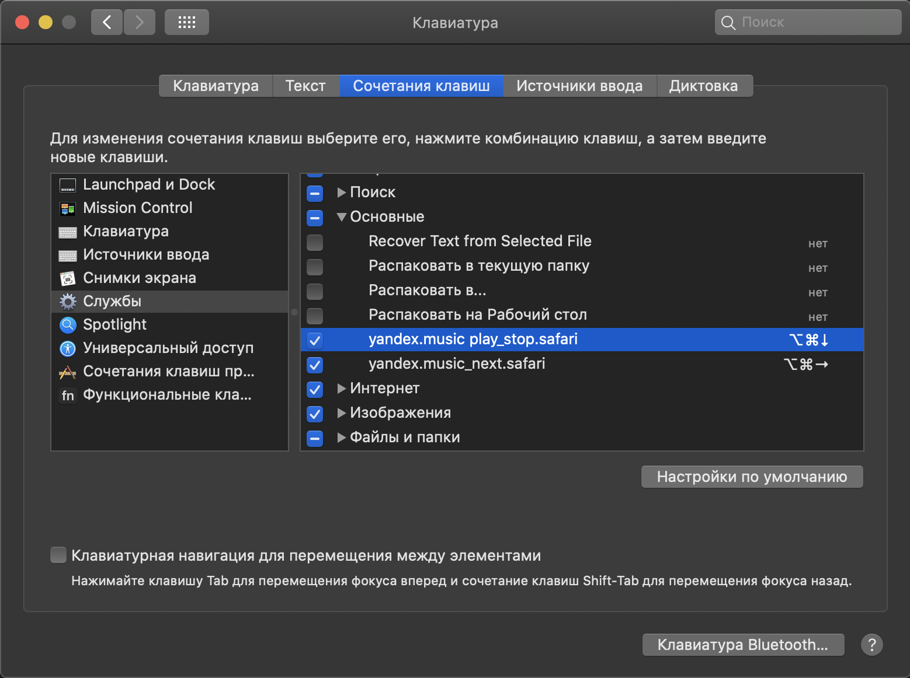
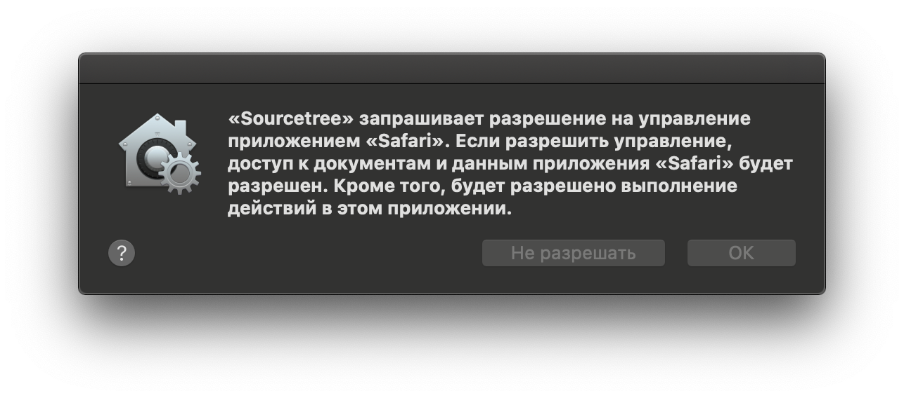

# Yandex.Music (Safari)

1. Установка workflow-файла двойным кликом
2. Установка горячих клавиш:
Системные настройки > Клавиатура > Сочетания клавиш > Службы -> Основные.
Находим yandex.music_next.safari, устанавливаем сочетание клавиш.
3. Включаем меню "Разработка" в Safari, если его нет:
Safari -> Настройки -> Дополнения. Отмечаем "Показывать меню Разработка в строке меню"
4. Устанавливаем разрешение на выполнение JavaScript:
Safari > Разработка > Разрешить событиям Apple Events выполнять JavaScript

После данных настроек можно управлять треками Яндекс.Музыки из любой программы посредством горячих клавиш.
При первом успользовании программы могут выбрасывать диалоговое окно, например

